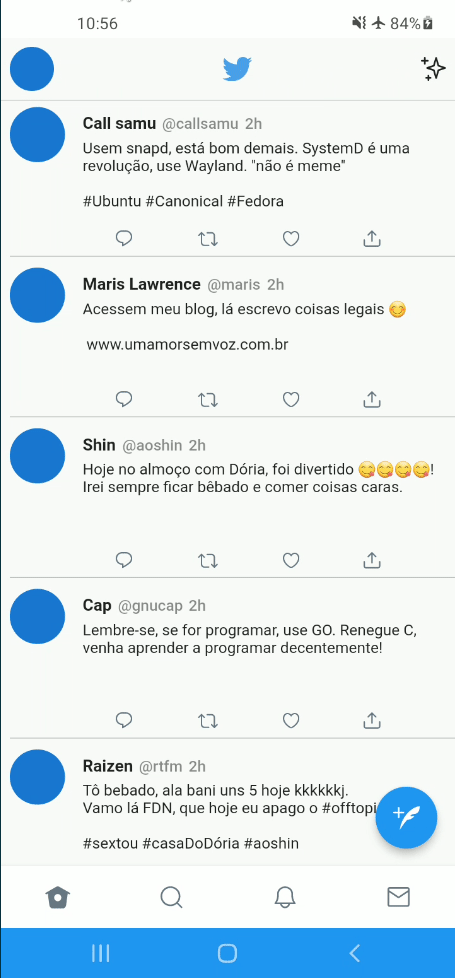

# Twitter Clone Flutter

Clone do Twitter feito em menos de 3 horas.

## Adendos
1 - Ainda não decidi como irei deixar flexível o tamanho do container com o texto do usuário, talvez com ternário.

2 - Limite de caracteres não definido, irá ajudar no passo a cima.

3 - Dava para fazer a barra inferior de várias maneiras, testei uma nova.

4 - O código está bagunçado, quando fizer algo com API aplico um MVC decente.

